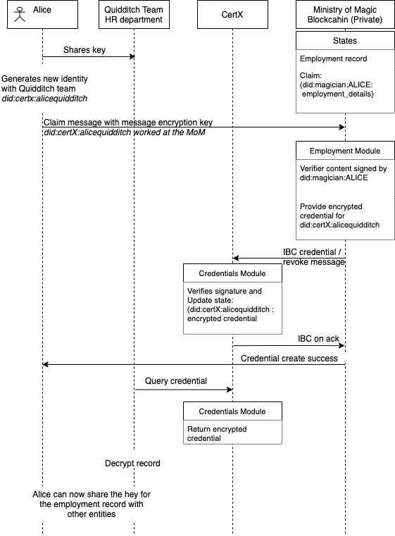

# mom

## MoM (Issuer Zone)

This directory represents the Ministry of Magic blockchain for use case 2.

With potentially sensitive data, such as employment records, this blockchain is considered private.

The high level interactions with certX, verifier and users:


## employments module

This module records employment records, however, unlike [muggleAuth](../muggleauth/readme.md),
the credential provided to *certX* is encrypted and only the credential holder, in our case, Alice,
will have the key, where she can share with her potential employers to review her credentials.

### employment Module

This modeule stores the employment record in `record` and upon requests from a user:-

1. checks if the record exists
1. if so, encrypts the record
1. sends IBC packet `eCredential` to *certX*

## Useful cmd

```sh
# Queries the list of employment record 
MoMd query employments list-record --node tcp://localhost:46657

# send an encrypted credential to certX
# unlike muggleAuth, here Alice might want to provide a reference did
# e.g. her initial application to the Quidditch team was done with did:certX:aliceQuidditch
MoMd tx employments send-eCredential employments channel-0 did:certX:aliceQuidditch 0 --node tcp://localhost:46657 --home .home --from alice
```

To query the encrypted credentials, please refer to [certX](../certX/readme.md)
