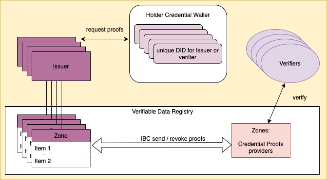

# CertX

This project is designed to demostrate the use of IBC between different zones in the Cosmos ecosystem for privacy perserving credential management.
**This project is incubated for the submission of HackATOM HCMC 2021**

## Motivation

As we all become increasing aware of the risk of having our privacy taken away whilst demanding interoperability between systems,
a single entitle or even blockchain providing the the single source of truth is no longer satisfactory.

This is where IBC becomes a critical component on which the future is built on.

Since the relayer service can be external, it makes sense to design for cases where the packets sent can be plain text or encrypted.

The use cases we designed for are communications between:

1. Private to Public zones where information is public: [Use Case 1]
1. Private to Public zones where information is authorised by the sender only [Use Case 2]
1. Private to Private zones (key-exchanged) [Use Case 3]

With all the cases listed, this project uses the concepts of verifiable credential to showcase IBC usage.
We use [*dencentralised identifiers*] for entities to ensure no social mapping, behaviour patterns can be derived.

### Design Overview

It is important to conform to standards and practices that already works well and only make adjustments where needed. No point re-inventing the wheel!

We follow W3C recommendations of Verfiable Credential. A summary of the [roles] defined are as such:


- *Issuer*: A role an entity performs by asserting claims about one or more subjects, creating a verifiable credential from these claims, and transmitting the verifiable credential to a holder.
- *Holder*: A role an entity might perform by possessing one or more verifiable credentials and generating verifiable presentations from them. Example holders include students, employees, and customers.
- *Verifier*: A role an entity performs by receiving one or more verifiable credentials, optionally inside a verifiable presentation, for processing. Example verifiers include employers, security personnel, and websites.
- *Verifiable data registry*: A role a system might perform by mediating the creation and verification of identifiers, keys, and other relevant data, such as revocation registries, issuer public keys, and so on, which might be required to use verifiable credentials.  Example verifiable data registries include trusted databases, decentralized databases, government ID databases

We restrict ourselve to provide, to all the users (Issuer, Holder, Verifier), the same interface as this model, i.e. only communicating with a Verifiable data registry.

However, they may or may not communicate to the **same** verifiable data registry and this is where IBC connects the different services provided by the registry.
This is demonstrated here:



- Each holder will have as many DID as needed, these may be used once or resued as they see fit
- The Issuer - Holder identifiers may or may not be the same as Holder - Verifiable identifiers

### Role of CertX

In all use case, **CertX** acts as a proofs provider. The proofs may be plain text or encrypted.
**CertX** itself does not provide any recognition or list of authorities to trust etc.
It is the verifiers' choice as to if a proof is valid / useful or not.

**Critically**: Either the holder or the verifier needs to register on **CertX** as this will be unnecessary friction.
This usage of this service is strictly with IBC.

[roles]: https://www.w3.org/TR/vc-data-model/#roles
[*dencentralised identifiers*]: https://www.w3.org/TR/did-core/
[Use Case 1]: (#user-case-1:-vaccination-records)
[Use Case 2]: (#user-case-2:-employment-records)
[Use Case 3]: (#user-case-3:-medical-records)

---

## Use case 1: Vaccination records

- Alice wants to demonstrate to a restaurant that she has been fully vaccinated.
- The restaurant does not need to know who Alice is other than the fact she has been vaccinated.
- Alice does not want to reused an the identity for the restaurant for other services as she does not want to be tracked.

### MuggleAuth (Issuer Zone)

This represents the authorities for muggles (non-magical humans).
For example, it might be a blockchain that stores and provide verifiable credential for registered citizens,
such as driver license, health record, and in this case, a vaccination record.

With potentially sensitive data, this blockchain is considered private.

#### Vac Module

The `Vac Module` provides states that stores (1) the credentials and (2) the proof for requested claims from muggles.

The first state is updated by direct messages to the module and is the lookup to facilitate the provision of proof.

The second state is a record that allows for the Issuer to:

- revoke any proofs (perhaps Alice's vaccine is not effective with new variant)
- recall (i.e. if there is an outbreak at the restaurant, authorities may want to notify Alice)

#### Vac Types

```sh
Credential: {
    # Issuer of the claim, e.g. Health Authority
    issuer: did,
    # Subject the claim is about, e.g. Alice's muggle did
    holder:did,
    # Actual claim, e.g. number of vaccination recieved
    claim: Int 
}

ProofRequest {
    message: {
        # The known identifier, e.g. Alice's muggle did
        holder: did,
        # The identifier for the verifier, e.g. Alice's new did created for the retaurant
        subject: did,
        # Verifier this proof is meant to be for, e.g. restaurant
        verifier: did,
        # Actual claim, e.g. number of vaccination recieved or simply fully / partial / none
        # (In the case that types of vaccine have different number requirements, should not disclose)
        claim: some_claim_description,
    },
    # Signature of the message signed by the holder and related metadata
    signature: signature_info 
}

ProofRecord {
    # message, in this case it is not encrypted
    message: {
        # The known identifier, e.g. Alice's muggle did
        holder: did,
        # The identifier for the verifier, e.g. Alice's new did created for the retaurant
        subject: did,
        # Verifier this proof is meant to be for, e.g. restaurant
        verifier: did,
        # Issuer of this proof, e.g. health authority
        issuer: did 
        # Actual claim, e.g. number of vaccination recieved or simply fully / partial / none
        # (In the case that types of vaccine have different number requirements, should not disclose)
        claim: some_claim_description,
    },
    # Signature of the message (in plain text) and related metadata
    signature: signature_info 
}
```

### CertX (Proofs Provider)

This is a publicly accessible Blockchain to store proofs.

#### CertX Module

The `CertX Module` simple receives IBC messages from Issuer Zones and records the proofs.

#### CertX Types

```sh
VerifiableCredential {
    # The identifier for the verifier, e.g. Alice's new did created for the retaurant
    subject: did,
    # Verifier this proof is meant to be for, e.g. restaurant
    verifier: did,
    # Issuer of this proof, e.g. health authority
    issuer: did 
    # Actual claim, e.g. number of vaccination recieved or simply fully / partial / none
    # (In the case that types of vaccine have different number requirements, should not disclose)
    claim: some_claim_description,
    # Signature of the Issuer and related metadata
    signature: signature_info 
}
```

## Use case 2: Employment records

TODO

## Use case 3: Medical records

TODO

