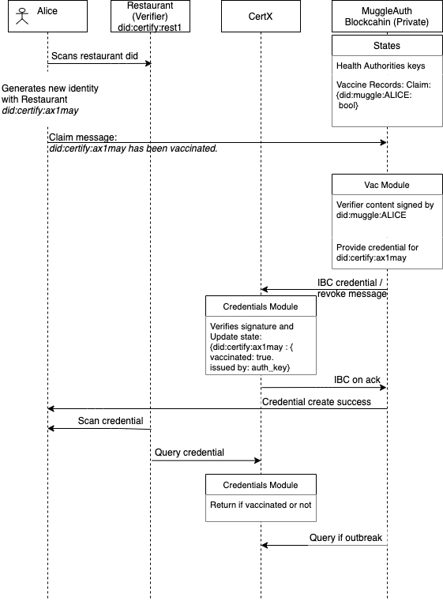

# muggleAuth

## MuggleAuth (Issuer Zone)

This represents the authorities for muggles (non-magical humans).
For example, it might be a blockchain that stores and provides verifiable credentials for registered citizens,
such as driver license, health record, and in this case, a vaccination record.

With potentially sensitive data, this blockchain is private.

The high level interactions with certX, verifier and users:



### Vac Module

The `Vac Module` provides state that stores (1) the credential and (2) the proof for claims requested by muggles.

The first state updated by direct messages to the module and is the lookup to facilitate the provisioning of the proof.

The second state is a record that allows for the Issuer to:

- revoke any proofs (perhaps Alice's vaccine is not effective with new variant)
- recall (i.e., if there is an outbreak at the restaurant, authorities may want to notify Alice)

### Vac CLI

_A hackathon version of the credential wallet interface:_

To provide user with a simple interface, when user wants to send a verifiable credential, the CLI automatically
creates and stores a new keypair, simulating the creation of a new `did`. This new unique did is then used as the subject
of the claim, i.e., what the verifier sees.

### Vac Types

```sh
# Stores all credentials 
Credential: {
    # Verifier this proof is meant to be for, e.g. restaurant
    verifier: did
    # Issuer of the claim, e.g. Health Authority
    issuer: did,
    # Subject the claim is about, e.g. Alice's muggle did
    holder:did,
    # Actual claim, e.g. vaccination record received
    claim: claim_string
}

# Packets from other chains via IBC
verifiableCredential {
    # message, in this case it is not encrypted
    message: {
        # The identifier for the verifier, e.g. Alice's new did created for the restaurant
        subject: did,
        # Verifier this proof is meant to be for, e.g. restaurant
        verifier: did,
        # Issuer of this proof, e.g. health authority
        issuer: did 
        # Actual claim, e.g.  vaccination record received or simply fully / partial / none
        # (In the case that types of vaccine have different number requirements, should not disclose)
        claim: some_claim_description,
    },
    # Signature of the message (in plain text) and related metadata
    signature: signature_info 
}

```

## Useful cmd

```sh
# list all keys
muggleAuthd keys list --home .home

# create record from healthauth for alice
# the first arg is not actually used since it is signed by healthauth
muggleAuthd tx vac create-credential "_healthauth" "did:muggleAuth:<some_address>" "2" --from  healthauth --home .home

# sends the verifiable credential for verifier restaurant81
muggleAuthd tx vac send-verifiableCredential <port> <channel> did:certX:restaurant81 0 --from alice --home .home

```
